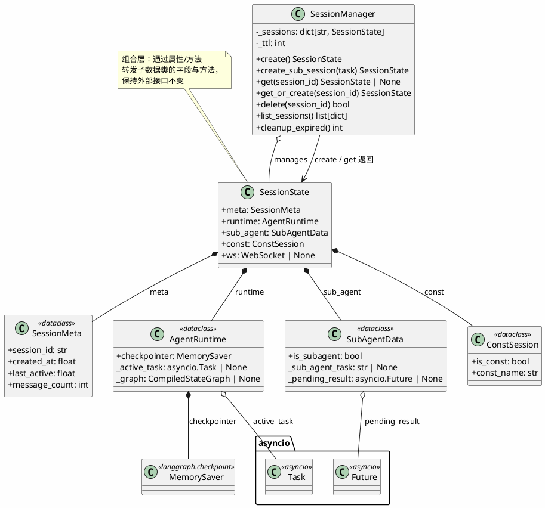

# 会话管理 — Session Manager



## 包结构

```
api/
└── session/
    └── manager.py        # SessionMeta, AgentRuntime, SubAgentData, ConstSession,
                          # SessionState, SessionManager, session_manager
    └── const_store.py    # 固定会话 YAML 持久化
```

## 数据流

```
SessionManager
  ├─ create() → 新会话（无 checkpointer 历史）
  ├─ get_or_create(id) → 恢复已有/创建新会话
  ├─ create_sub_session(task) → Sub-agent 会话（带 pending Future）
  ├─ list_sessions() → 排序后的活跃会话列表
  └─ cleanup_expired() → TTL（默认 30 分钟）过期清理
```
